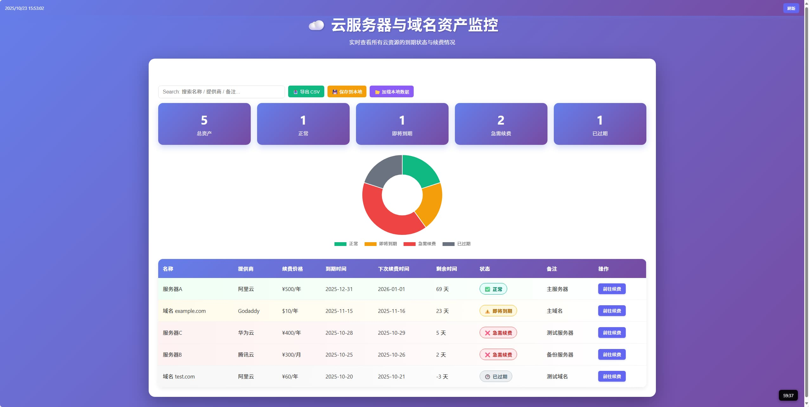

# Cloud Assets – 云资产到期监控面板
[](https://choosealicense.com/licenses/mit/)
[](https://你的用户名.github.io/cloud-assets)

一个**轻量、美观、响应式**的网页工具，帮你实时查看：

- 云服务器
- 域名

的 **到期时间、剩余天数、续费状态**，并支持 **自动刷新 + 手动续费跳转**。

> 部署到任意静态服务器（GitHub Pages、Vercel、Cloudflare Pages）即可使用！

---

## 特性亮点

| 功能                 | 说明                                      |
| -------------------- | ----------------------------------------- |
| **剩余时间自动计算** | 实时显示「剩余 X 天」                     |
| **状态颜色区分**     | 正常 / 即将到期 / 急需续费 / 已过期       |
| **统计卡片**         | 一眼看出各类资产数量                      |
| **续费直达链接**     | 一键跳转到控制台                          |
| **自动刷新**         | 每小时自动更新倒计时                      |
| **完全响应式**       | 手机、平板、桌面完美适配                  |
| **实时搜索筛选**     | 模糊搜索名称 / 提供商 / 备注              |
| **到期时间排序**     | 升序/降序一键切换                         |
| **当前时间显示**     | 左上角实时时间                            |
| **状态分布饼图**     | Chart.js 动态可视化                       |
| **导出 CSV**         | 一键导出完整清单（带剩余天数、状态）      |
| **本地数据保存**     | `localStorage` 持久化，刷新不丢           |

---

## 预览截图



> 手机端同样流畅，支持横竖屏自动适配

---

## 如何使用

### 1. 克隆仓库

``` bash
git clone https://github.com/shuo0261/cloud-assets.git
cd cloud-assets
```

### 2. 编辑数据

打开 `data.js`，按格式添加你的资产：

```js
{
  name: '服务器A',
  provider: '阿里云',
  renewalPrice: '¥500/年',
  expirationDate: '2025-12-31',
  nextRenewalDate: '2026-01-01',
  notes: '主服务器',
  link: 'https://account.aliyun.com'
}
```

### 3. 部署（任选）

| 平台                 | 操作                                      |
| -------------------- | ----------------------------------------- |
| **GitHub Pages**     | 推送到 `main` → Settings → Pages → 启用   |
| **Vercel**           | `vercel` 一键部署                         |
| **Cloudflare Pages** | 绑定仓库即可                              |

> 部署后访问：`https://shuo0261.github.io/cloud-assets`

---

## 自动刷新设置

- 默认 **每 1 小时** 自动刷新一次
- 右下角显示倒计时（`59:59` → `00:00`）
- 右上角有「**手动刷新**」按钮
- 可在 `script.js` 修改间隔：

```js
const REFRESH_INTERVAL = 60 * 60 * 1000; // 1小时
// 改成 30 分钟：30 * 60 * 1000
// 改成每天：24 * 60 * 60 * 1000
```

---

## 高级功能一览

| 功能           | 操作方式                                 |
| -------------- | ---------------------------------------- |
| **搜索**       | 输入框实时过滤                           |
| **排序**       | 点击「按到期时间排序」切换升序/降序       |
| **导出 CSV**   | 点击「导出 CSV」下载完整清单             |
| **本地保存**   | 点击「保存到本地」→ 刷新后「加载本地数据」|
| **饼图**       | 自动统计各状态数量，响应式显示           |

---

## 自定义建议

| 想改什么           | 修改文件                             |
| ------------------ | ------------------------------------ |
| 主题颜色           | `style.css` 中的 `#6366f1`           |
| 状态阈值           | `script.js` 中的 `getStatus()`       |
| 添加 SSL/数据库    | `data.js` + 表格列 + `script.js`     |
| 暗黑模式           | 加 `prefers-color-scheme` CSS        |
| 自动刷新间隔       | `script.js` 中的 `REFRESH_INTERVAL`  |
| 搜索字段扩展       | 修改 `filterAndSort()` 中的条件      |

---

## 技术栈

- **HTML5 + CSS3 + Vanilla JS**
- **无依赖、无构建、无框架**
- **纯静态，加载 < 1s**
- **Chart.js**（仅用于饼图，CDN 加载）

---

## 贡献

欢迎提交 Issue 或 PR！ 
已实现功能可直接使用，未来可扩展：

- 邮件/微信提醒（配合后端）
- 批量导入 CSV
- 多用户支持
- 暗黑模式切换

---

## License

[MIT License](LICENSE) – 随便用，记得保留版权

---

**Star 本项目，让你的云资产不再过期！**

